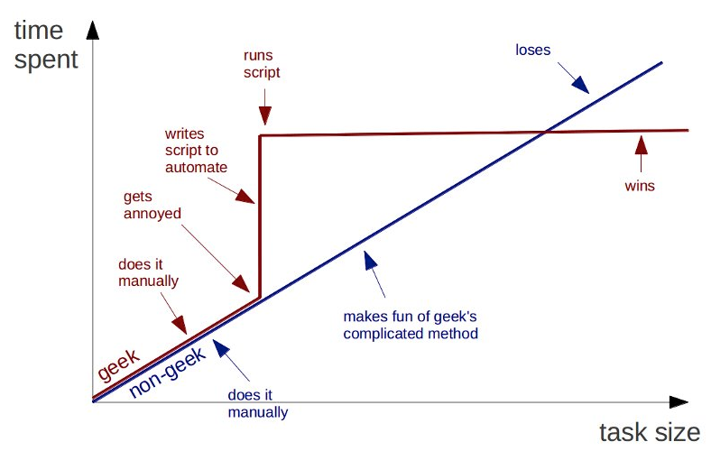

% Software Carpentry - Overview
  University of Delaware
% Software Carpentry Instructors - Josh Herr & Josh Adelman
% September 11th - 12th 2014

## Copy This Lecture!
  
  
  
  
  
  
 Software Carpentry Overview by <a xmlns:cc="http://creativecommons.org/ns#" href="http://software-carpentry.net" property="cc:attributionName" rel="cc:attributionURL">Software Carpentry</a> is licensed under a <a rel="license" href="http://creativecommons.org/licenses/by/3.0/deed.en_US">Creative Commons Attribution 3.0 Unported License</a>.

# More About Software Carpentry

## History

* Founded by Greg Wilson in 1998, with the goal of teaching scientists how to use supercomputers at LANL.
* Open sourced materials from 2004-present
* SWC is currently minimally funded by the Sloan Foundation & Mozilla Foundation, but all teaching personel are volunteers

## What We Will Teach (We're Flexible here...)

* Unix Command Line Interface (Shell)
* Shell automation 
* Version Control
* Python
* Testing
* Some nice python modules (numpy, pandas) 

## What We *Actually* Teach

* A computer is just another piece of lab equipment
* Do not be afraid to analyze your data
* Could you be using your time more efficiently?
* Let the computer repeat it - automation!
* Automation leads to a reduction in human errors

*How to THINK like a programmer*

## Who We Teach

<table>
<tr>
<td></td>
<td></td>
</tr>
<tr>
<td></td>
<td></td>
</tr>
</table>

## Who We Are

* Josh Herr (Michigan State University)
* Josh Adelman (University of Pittsburgh)

 
## Our Goals for You

### We will take you on a tour of:

* Managing and sharing Software, Data, and Manuscripts with **Git**
* Automating things with the **shell**
* Practical Programming with **Python**
* Scientific Computing with Python (numpy, matplotlib)
* Using Git to keep track of changes to your files (collaboration and data provenance)

# Some High-Level Advice (mainly from Greg Wilson)

## Let's try to work in multiple languages
<comment>
You speak multiple languages when interacting with a computer.
Choosing to use a new tool, library, or computer language can be similar to
learning a new verbal language:
</comment>

+ There is a high initial startup cost as you learn vocabulary, grammar, and
idioms
`sum(x*y for x,y in itertools.izip(x_vector, y_vector))`

+ But once you have gained some fluency, you will find yourself capable of
new things!
+ You will learn faster by observing and working with others who are more
skilled than you
+ Aim for languages and tools that allow you to express your models and
manage your data simply. 

## Make it work right first, make it fast later.
* "Premature optimization is the root of all evil." -- Donald Knuth
* Directing your attention to making it use less disk / less memory /
less time from the start is wrongly directed attention.

## Increase debugging bandwidth

* **REPL (read-eval-print-loop)** environments tighten the coupling between
the code you write and the results you see, increasing productivity.
* Development environments and debuggers give you more information at once 
* Test your procedures on subsets of your data **so that you learn whether
it works faster**

# Don't Repeat Yourself (or Others)

## Automate common actions by saving simple blocks of code into **scripts**

* A script is a set of commands organized into a single file
* The script is the basest unit of scientific programming, you should be
comfortable writing these whenever you want to save or otherwise document or
repeat your actions
* Use scripts to explore new ideas, they are easy to write and throw away
* **Don't repeat commands into your REPL, save them to a script**

## Refactor commonly used blocks of code into **functions**

* Eventually, you will find that your scripts have a lot of repeated code,
or that you are spending a lot of time adjusting parameters at the top of
the file
* Refactor out repeated code into **function calls** in your scripts and
implement the **function** either in the same file or a separate one
* Be comfortable with the calling and return syntax of your programming language
environment, whether it is bash or Python
* **Don't repeat code in scripts, refactor them to functions**

## Group commonly used functions into **libraries**

* If you have to write a lot of software functions,
consider designing and releasing a library so that
others do not have to share your misfortune
* Check that nobody else has implemented the functionality you need
* If something close exists, it may be worth adapting to your needs if the
project is of high quality and suitably licensed
* *Openly licensed non-commercial libraries tend to have a much longer effective
lifespan than unreleased codes*
* **Share your code with others, and use their code**

# Reduce Complexity

## Basic strategies

* Use languages and libraries that reduce the complexity of
your work
* It is worth installing a complicated or expensive software tool if your
computations or model are naturally expressed with it
* Always look for opportunities to write **less** code
    + you will have to do less initial work (sometimes)
    + you will introduce less bugs
    + your code will be easier to understand and maintain
* Keep individual functions short, single-purpose, possible
 to be confident in festooning.

## Back up your data!

## Use version control for checkpointing and collaboration

* use local version control software to checkpoint personal code development
  + checkpointing your work encourages wild ideas and late-night coding sessions
  + you can easily restore back in the morning if it was a bad idea
* use **distributed version control** to collaborate with others
* We advocate *Git*, but you may be stuck with whatever your group uses

# Verify and Validate your Code

## Principles of verification and validation
* **verification** - is your code correctly written?
* Be paranoid.
  + test small things!  
  + test that what you assume is TRUE is in fact so.
* test frameworks can help you verify your code
* **validation** - do your computations accurately model the phenomena in question?
  + not a good candidate for automation.  (Not sad at all)

## Document your computational work
* Save every bit of code you use for generating publishable results
* Document and comment your code for yourself as if you will need to understand
it in 6 months
  + use README files liberally
  + as well as file-level, function-level, and inline documentation
* If any piece of code is too complex to easily describe, consider refactoring
it

## Super Simplified Schedule 
* Today 
* **9:00-12:00** The Shell
* **1:00-4:30**  Python 
* Tomorrow
* **9:00-12:00** Version control with Git 
* **1:00-4:30**  More Advanced Python

# Luke, Use the stickies...

## Green post it note means I have completed the task or am not having trouble.

## Red post it note means I need some help but am still working on the problem.

## At the end of the day, write one thing you liked on the green and one thing you would like to see improved on the red - we'll respond!

# Closing Thoughts

## You sometimes need geeks.  You never need dorks.

<table>
<tr>
<td></td>
</tr>
</table>

